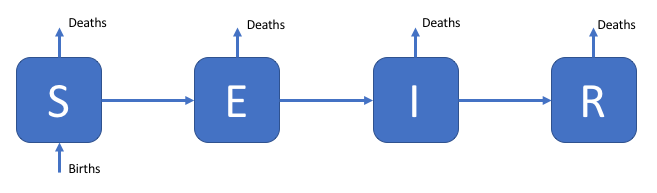
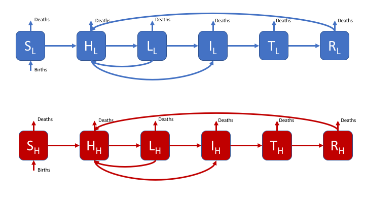
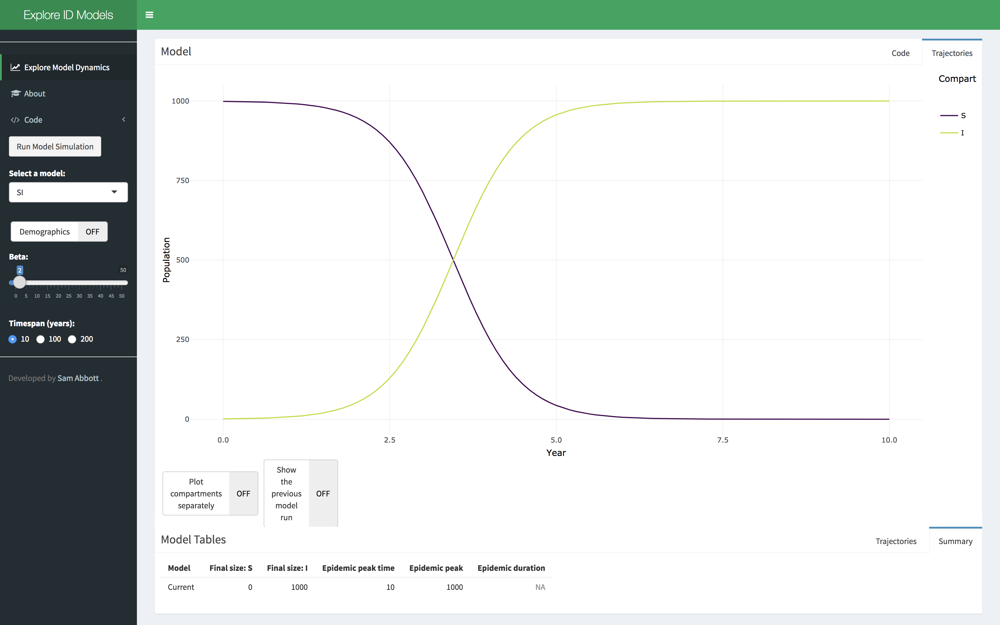
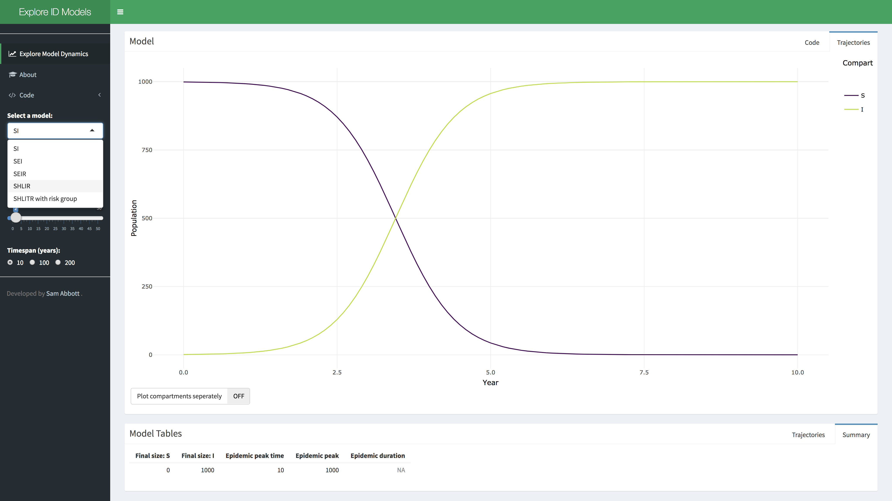
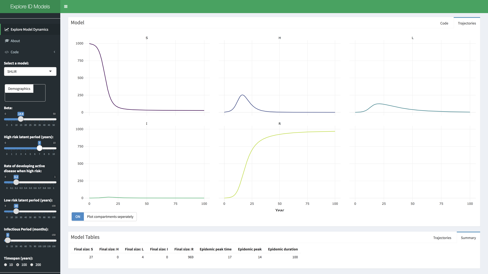

```{r, echo = FALSE}
knitr::opts_chunk$set(
  collapse = TRUE,
  echo = FALSE,
  comment = "#>",
  fig.path = "README-",
  fig.align = "center"
)
```

# Explore Infectious Disease Models

[](https://mybinder.org/v2/gh/seabbs/exploreidmodels/master?urlpath=shiny/app/)
[](https://mybinder.org/v2/gh/seabbs/exploreidmodels/master?urlpath=rstudio)

This shiny app has been developed to allow the exploration of the parameter space of [compartmental infectious disease models](https://en.wikipedia.org/wiki/Compartmental_models_in_epidemiology). It is designed to be used as a teaching aid when introducing people to the concepts behind infectious disease models without requiring them to interact with the underlying code. A number of infectious disease models are included, such as a Susceptible, Exposed, Infected, Recovered model the flow diagram for which can be seen below.

```{r out.width = "30%", fig.cap = "A susceptible, exposed, infected, recovered model."}

```

An example of a more complex model for [Tuberculosis](https://en.wikipedia.org/wiki/Tuberculosis) is also included, 

```{r out.width = "50%", fig.cap = "A complex model of Tuberculosis, including reinfection, multiple latent compartments, risk groups and treatment."}

```

This includes a risk group, high and low risk latent states, reinfection for those who have recovered from active disease or are latently infected, and treatment. The impact of demographic processes are explored in all models. The code for each model can be viewed in the application. All functionality seen in this app is provided by   [`idmodelr`](https://github.com/seabbs/idmodelr).

## Using the app

- Click on the Explore Model Dynamics Tab in the menu on the left hand side. You should see this,

```{r out.width = "50%"}

```

- Select a model of interest, demographic processes can be toggled on or off. Click on the run model simulation button to simulate the model.

```{r out.width = "50%"}

```

- Explore the parameter space of the model using the provided sliders. A summary table of the model simulation is provided as are the raw simulation results. Show the previous model simulation using the previous model run slider. The model output can also be shown separately for each compartment using the plot compartments separately slider.

```{r out.width = "50%"}

```

## Running the App Locally

The app can be run directly from GitHub. Open R and run the following;

```{r run-github, echo = TRUE, eval = FALSE}
install.packages("shiny")
shiny::runGitHub("exploreidmodels", "seabbs")
```

If the above fails the likely reason is that a required package has failed to install. See [here](https://github.com/seabbs/exploreidmodels/blob/master/load_packages.R) for a list of required packages.

## Installation

### Manual Install

To install and run the shiny app locally on your own computer you will need to first install [R](https://www.r-project.org/), it is also suggested that you install [Rstudio](https://www.rstudio.com/products/rstudio/download/). After downloading the source code from [this repository](https://www.github.com/seabbs/exploreidmodels) click on the `exploreidmodels.Rprof` file, this will open an Rstudio window. Type the following code into the command line;

```{r, eval = FALSE, echo = TRUE}
install.packages("packrat")
packrat::restore()
```

To run the app open the `ui.R` file and press run, depending on your computer this may take some time.

### Using Docker

[Docker](https://www.docker.com/what-docker) is a container software that seeks to eliminate "works on my machine" issues. For installation and set up instructions see [here](https://www.docker.com/community-edition). 

This docker container is based on the [tidyverse](https://hub.docker.com/r/rocker/tidverse/) docker image, see [here](https://github.com/rocker-org/tidyverse) for instructions on use. To run the docker image run the following in a bash shell:

```{bash, eval = FALSE, echo = TRUE}
docker pull seabbs/exploreidmodels
docker run --rm -p 8787:8787 -e USER=exploreidmdoels -e PASSWORD=exploreidmodels --name exploreidmodels seabbs/exploreidmodels
```

The Rstudio server can be found on port `:8787` at your local machines ip (or localhost on windows). Alternatively the app has been deployed using [mybinder](). See [here](https://mybinder.org/v2/gh/seabbs/exploreidmodels/master?urlpath=rstudio) for the development environment and [here](https://mybinder.org/v2/gh/seabbs/exploreidmodels/master?urlpath=shiny/app/) for the app.


